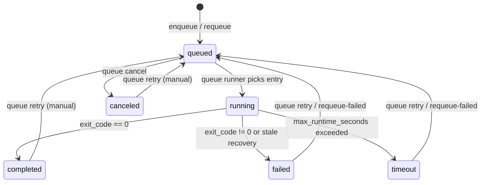

# Queue & Background Execution

## Basics

- Use `--background` to enqueue a run; the queue runner executes it.
- Foreground runs are also recorded for status tracking and show up in `dftflow queue status`.

## Queue/Background Flow

```mermaid
flowchart TD
  A[dftflow run] --> B{--background?}
  B -->|yes| C[enqueue run]
  C --> D[start queue runner]
  D --> E[queue runner picks entry]
  E --> F[subprocess: dftflow run --no-background]
  F --> G[update status]
  B -->|no| H[foreground run]
  H --> I[register queue entry (tracking)]
  I --> G
```

## Status Transitions



## Common Commands

```bash
dftflow run input.xyz --config run_config.yaml --background

dftflow queue status
dftflow queue cancel <RUN_ID>
dftflow queue retry <RUN_ID>
dftflow queue requeue-failed
dftflow queue prune --keep-days 30
dftflow queue archive
```

## Related Files

- Queue file: `~/DFTFlow/runs/queue.json`
- Queue runner log: `~/DFTFlow/log/queue_runner.log`
