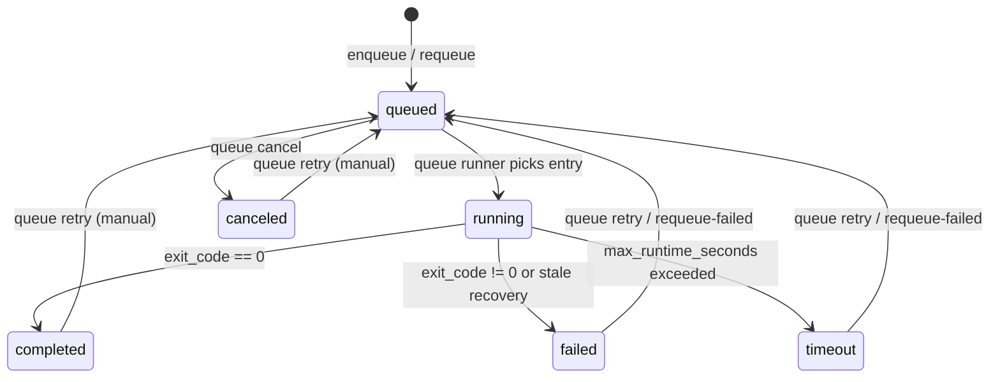

# 큐와 백그라운드 실행

## 기본 개념

- `--background` 옵션으로 실행하면 큐에 들어가고, 큐 러너가 실행을 담당합니다.
- 포그라운드 실행도 큐 상태에 기록되어 `dftflow queue status`에서 함께 보입니다.

## 큐/백그라운드 흐름

```mermaid
flowchart TD
  A[dftflow run] --> B{--background?}
  B -->|yes| C[enqueue run]
  C --> D[start queue runner]
  D --> E[queue runner picks entry]
  E --> F[subprocess: dftflow run --no-background]
  F --> G[update status]
  B -->|no| H[foreground run]
  H --> I[register queue entry (tracking)]
  I --> G
```

## 상태 전이



## 주요 명령어

```bash
dftflow run input.xyz --config run_config.yaml --background

dftflow queue status
dftflow queue cancel <RUN_ID>
dftflow queue retry <RUN_ID>
dftflow queue requeue-failed
dftflow queue prune --keep-days 30
dftflow queue archive
```

## 관련 파일

- 큐 파일: `~/DFTFlow/runs/queue.json`
- 큐 러너 로그: `~/DFTFlow/log/queue_runner.log`
